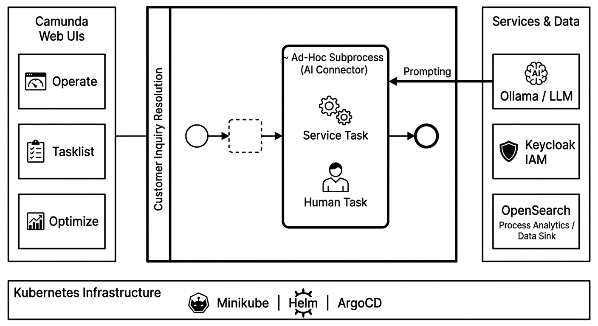

# Enterprise Process AI Stack 🚀

The **Enterprise-Process-AI-Stack** is a reference architecture designed for highly regulated industries. It demonstrates how **Deterministic Orchestration meets Intelligent Execution** by bridging the gap between traditional BPMN and autonomous AI agents.

---

*   **Status:** 🚧 Work in Progress
*   **Goal:** Demonstrating secure, scalable, and auditable AI orchestration using an **"Adaptive Case Management 2.0"** approach with 100% data sovereignty.

## 🎯 Target Architecture

This project showcases the integration of traditional process governance with modern Agentic AI, optimized for local or air-gapped environments to ensure maximum security.

### Key Pillars:
*   **Orchestration:** **Camunda 8 Self-Managed** (Zeebe Engine) provides the deterministic backbone and **full audit trails** for every AI decision – a hard requirement for compliance.
*   **Agentic AI:** Utilization of **Ad-Hoc Subprocesses** as AI Connectors. This allows the agent to flexibly choose between Service Tasks (Tools) and Human Tasks (Escalation).
*   **Data Sovereignty:** Local LLM inference via **Ollama**, ensuring sensitive request data never leaves the controlled environment.
*   **Security-First:** Centralized Identity Management via **Keycloak (OIDC)**, securing all endpoints and the Camunda stack.

## 📋 Featured Use Case: "Customer Inquiry Resolution"

The stack is demonstrated through a universal **Customer Inquiry Resolution** workflow. It handles the lifecycle of a digital application where an AI Agent autonomously manages missing information or document validation within a governed BPMN sub-flow, escalating to humans only when necessary. This ensures that even "creative" AI steps remain within a compliant, trackable framework.

## 🏗️ Technical Stack

| Category | Technology                                                   |
| :--- |:-------------------------------------------------------------|
| **Backend** | Java 21, Spring Boot 3.x, Zeebe Java Client (Worker Pattern) |
| **BPMN / DMN** | Camunda 8 (Zeebe), modeled with Camunda Desktop Modeler      |
| **AI Orchestration** | Camunda Agentic AI Connector (Native Integration)            |
| **Storage & Data** | OpenSearch (Analytics Sink)                                  |
| **Security** | Keycloak (OIDC), OAuth2                                      |
| **Local AI** | Ollama (OpenAI-compatible API / GGUF)                        |

## ⚖️ Architectural Evaluation: Why no Spring AI?

During the design phase, **Spring AI** was evaluated but deliberately excluded to reduce architectural redundancy:
*   **Native Orchestration:** By using Camunda’s native Agentic AI capabilities, the orchestration logic stays within the BPMN model (Single Source of Truth) instead of being hidden in Java code.
*   **Auditability:** Standardizing on the Camunda Connector ensures that "thoughts" and "tool calls" of the agent are natively logged in Zeebe/Operate for compliance audits.
*   **Process Transparency:** Non-technical stakeholders can see the agent's decision paths in the BPMN diagram rather than having to parse application logs.

## 🗺️ Roadmap

- [ ] **Phase 1:** Kubernetes Infrastructure (Minikube, Helm, ArgoCD)
- [ ] **Phase 2:** Camunda 8 Self-Managed Deployment & Service Provider Deployment
- [ ] **Phase 3:** Agentic AI Connector Setup
- [ ] **Phase 4:** Process Application (BPMN, Forms, Java Job Workers)

## 🏗️ Target Runtime Environments

> **"One Stack, Any Scale"**  
> This project follows a unified GitOps approach. Whether deploying to a high-power workstation or a power-efficient edge device, the architecture remains identical, ensuring true environment parity.

| Environment | Specs (Tested) | Use Case |
| :--- | :--- | :--- |
| **High-Power Desktop** | 64 GB RAM / 16 GB VRAM (RTX) | Development, Heavy Load Testing, Large LLMs |
| **Edge AI (Jetson)** | 16 GB Unified Memory (Orin Nano) | Industrial Edge, Power-Efficient Sovereign AI |
| **Minimal / Laptop** | 16 GB RAM (CPU only) | Proof of Concept, Local Process Testing |

### ⚙️ Multi-Platform Strategy
Deployment is managed via **Helm profiles** and **ArgoCD**, allowing for seamless switching between resource-constrained and high-performance hardware:

*   **Resource Efficiency:** JVM and OpenSearch heap sizes are dynamically adjusted based on the target profile.
*   **Hardware Acceleration:** Automatic detection and utilization of NVIDIA CUDA cores for LLM inference (where available).
*   **Architecture Agnostic:** Full support for both `x86_64` and `arm64` (Multi-Arch Docker Images).
---

Visuals created with Google Gemini.

## 📄 License

This project is licensed under the MIT License - see the [LICENSE](LICENSE) file for details.