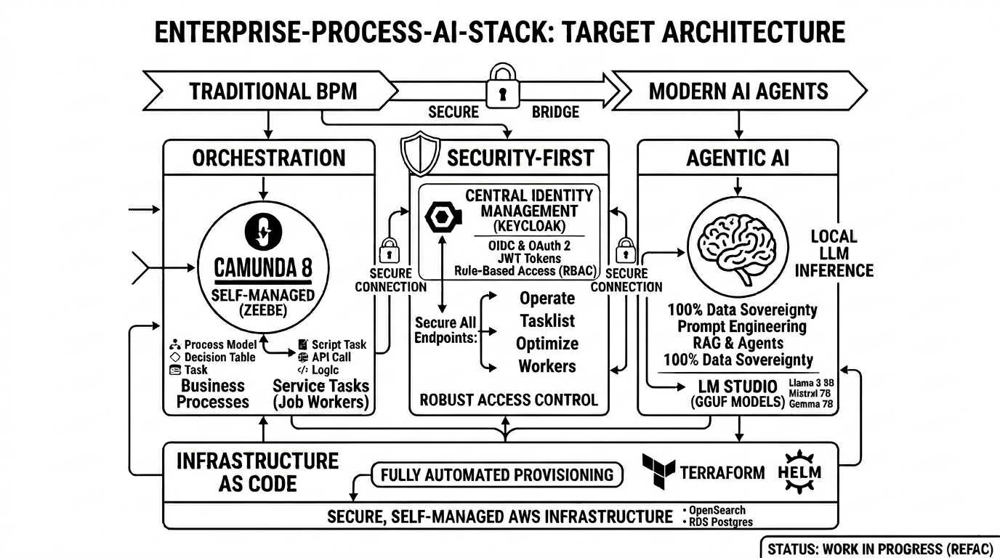

# Enterprise Process AI Stack 🚀

The **Enterprise-Process-AI-Stack** is a reference architecture designed for highly regulated industries. It demonstrates how to bridge the gap between traditional Business Process Management (BPM) and modern autonomous AI agents, while maintaining **100% data sovereignty** through local LLM inference and robust identity management.

---

*   **Status:** 🚧 Work in Progress (Refactoring from private Gitea to Public Showcase)
*   **Goal:** Demonstrating a secure, scalable, and AI-driven process orchestration for highly regulated industries (e.g., Insurance/Banking).

## 🎯 Target Architecture (Zielbild)

This project aims to demonstrate the integration of traditional Business Process Management (BPM) with modern AI Agents, hosted on a secure, self-managed AWS infrastructure.

### Key Pillars:
*   **Orchestration:** **Camunda 8 Self-Managed** (Zeebe Engine) for high-performance, cloud-native process automation.
*   **Agentic AI:** Integration of local LLMs (via **LM Studio**) into BPMN service tasks (Job Workers) to enable intelligent decision-making without data leakage to public APIs.
*   **Security-First:** Centralized Identity Management via **Keycloak using OIDC**, securing all endpoints, Camunda Operate, and Tasklist.
*   **Infrastructure as Code:** Fully automated provisioning using **Terraform** and **Helm**.

## 🏗️ Technical Stack

| Category | Technology                                                    |
| :--- |:--------------------------------------------------------------|
| **Backend** | Java 21, Spring Boot 3.x, Spring AI, Zeebe Java Client        |
| **BPMN / DMN** | Camunda 8 (Zeebe), modeled with Camunda Desktop Modeler       |
| **Cloud Services** | AWS (RDS PostgreSQL, OpenSearch), Terraform, Helm             |
| **Security** | Keycloak (OIDC), OAuth2                                       |
| **Local AI** | LM Studio (Local Inference / GGUF)                            |

## 🗺️ Roadmap

- [ ] **Phase 1:** Basic K8s Infrastructure & Database Setup (Terraform)
- [ ] **Phase 2:** Keycloak Identity Provider & OIDC Integration
- [ ] **Phase 3:** Camunda 8 Self-Managed Deployment via Helm
- [ ] **Phase 4:** Java Job Workers with Spring AI & Agentic Logic
- [ ] **Phase 5:** Observability (Logging with OpenSearch & Monitoring)

---

Visuals created with Google Gemini.

## 📄 License

This project is licensed under the MIT License - see the [LICENSE](LICENSE) file for details.