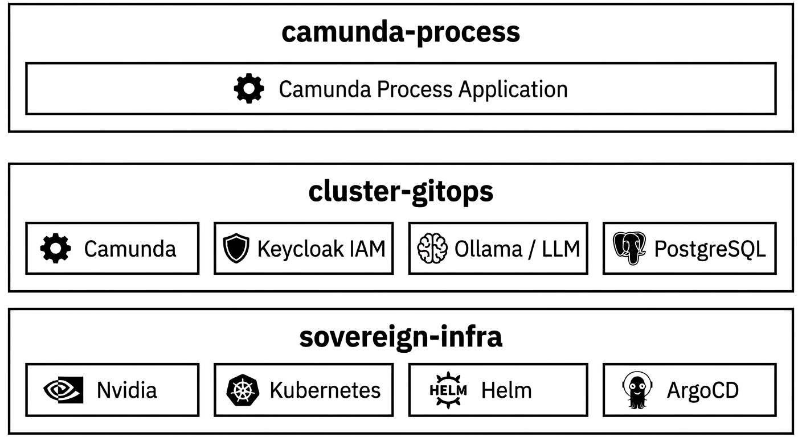

# Sovereign Camunda Agent Stack 🚀

<div align="center">
  
</div>

## ⚡ Summary

The **Sovereign Camunda Agent Stack** is a lightweight reference architecture to install Camunda 8 Agentic AI and Ollama LLMs on your own Linux hardware with Nvidia gpu and Debian-based OS, no data leaves your network. It contains GitOps to run under Kubernetes on different hardware profiles.


## 🚀 Roadmap & Phases

- **Sovereign Infra:** under test
- **Cluster Gitops:** under development
- **Camunda Process:** Planned


## 📋 Prerequisites
- **OS:** Debian-based Linux with NVIDIA Drivers & CUDA Toolkit installed (can be verified by running `nvidia-smi`).
- **Package Manager:** `apt` is available.
- **Basic Tools:** `curl`, `git`, `gpg`, `sed` are installed.
- **Kubernetes Tools:** `kubectl` is installed and available in your PATH.
- **Connectivity:** Internet access is required during the bootstrap process.
- **Repository:** You cloned the repo:
```git
git clone https://github.com/kj-hilger/sovereign-camunda-agent-stack.git
```

## 🏗 Sovereign Infra

Scripts to install hardware specific tools for GPU support, K8s and GitOps on different hardware profiles:

### Choose your profile

| Environment            | Specs (Tested)                           | Use Case                                               |
|:-----------------------|:-----------------------------------------|:-------------------------------------------------------|
| **High-Power Desktop** | 64 GB RAM / 16 GB VRAM (RTX)             | Development, Heavy Load Testing, Large LLMs            |
| **Edge AI (Jetson)**   | 16 GB Unified Memory (Orin Nano)         | Industrial Edge, Power-Efficient continuous operations |

### Bootstrap

``` bash
### Option A: High-Power Desktop
chmod +x ./sovereign-infra/install-desktop.sh
./sovereign-infra/install-desktop.sh

## Option B: Edge AI Jetson

chmod +x ./sovereign-infra/install-jetson.sh
./sovereign-infra/install-jetson.sh
```

Detailed documentation for Desktop

| Step | Description                                                                | Key Challenges                                                                                                                                                                                 |
|------|----------------------------------------------------------------------------|------------------------------------------------------------------------------------------------------------------------------------------------------------------------------------------------|
| 1    | NVIDIA Driver & CUDA Check                                                 | Drivers and CUDA toolkit must be manually installed on the host OS beforehand.                                                                                                                 |
| 2    | Installing & Configuring Docker                                            | Non-root user permissions require group modifications (`usermod`), often needing a full system logout/login before the user can interact with the Docker daemon.                               |
| 3    | NVIDIA Container Toolkit Config                                            | Must target the **host Docker engine** specifically via direct `/etc/docker/daemon.json` configuration, **⚠️overwrites existing ⚠**, ensuring GPU runtime sharing into downstream containers. |
| 4    | Installing Minikube & Helm                                                 | Requires a separate, native `kubectl` installation on the host OS to prevent command-not-found errors during automated script execution.                                                       |
| 5    | Bootstrapping Minikube (Tuning)                                            | Enforces Docker runtime internally within the cluster to allow `--gpus=all`. **⚠️Allocates 32768 MB RAM and 12 CPUs. ⚠**                                                                      |
| 6    | Installing ArgoCD                                                          | `--server-side` apply required, adds a desktop-specific patch to `NodePort` for direct access via the local web browser.                                                                       |

Detailed documentation for Jetson

| Step | Description                                                                | Key Challenges                                                                                                                                                                                        |
|------|----------------------------------------------------------------------------|-------------------------------------------------------------------------------------------------------------------------------------------------------------------------------------------------------|
| 0    | Boot Configuration & Cgroups Check                                         | Missing cgroup parameters cause memory crashes; requires reboot.                                                                                                                                      |
| 1    | Pre-Installation Checks                                                    | Verify Jetson hardware presence. **⚠Overwrites /opt/cni/bin/ ⚠**                                                                                                                                    |
| 2    | Installing NVIDIA Container Runtime & Network Config (containerd, flannel) | CRI unblocking and preconfiguring CNI for a stable network; aligning container runtimes with system‑wide containerd + NVIDIA runtime. **⚠fix versions for cni-plugins v1.4.0 and flannel v1.9.0 ⚠** |
| 3    | Installing K3s                                                             | None specific; standard K3s install using containerd endpoint.                                                                                                                                        |
| 4    | Enabling NVIDIA GPU Support in Kubernetes                                  | The Kubernetes resources for Nvidia Device Plugin fail on Jetson due to PCI‑based affinity and memory management issues, thus patches and enhancements are needed.                                    |
| 5    | Installing ArgoCD                                                          | Annotation limits for large manifests; requires server‑side apply.                                                                                                                                    |
| 6    | Resource Optimization                                                      | Minimizing log overhead and saving unified memory.                                                                                                                                                    |
| 7    | Verification                                                               | Final checks; ensure GPU registration and node allocatable resources.                                                                                                                                 |


### Post-Installation
* The installation configures Docker to run without `sudo` for the current user. If you encounter permission issues during the Minikube bootstrap, you may need to **log out and log back in** to apply the user group changes.
* Docker and Nvidia Toolkit will be updated via apt Package Manager.
* Run check script:
```bash
### Option A: High-Power Desktop
# No check script currently available for desktop.

## Option B: Edge AI Jetson
chmod +x ./sovereign-infra/check-jetson.sh
sudo ./sovereign-infra/check-jetson.sh
```

### Start again after reboot

```bash
### Option A: High-Power Desktop
minikube start \
--driver=docker \
--cpus=12 \
--memory=32768 \
--gpus=all \
--addons=ingress

## Option B: Edge AI Jetson
# No start command currently available for jetson.
```

### Delete All and Reinstall (with latest software versions)

```bash
### Option A: High-Power Desktop
chmod +x ./sovereign-infra/uninstall-desktop.sh
./sovereign-infra/uninstall-desktop.sh

## Option B: Edge AI Jetson
chmod +x ./sovereign-infra/k3s-uninstall.sh  # **⚠️ deletes all content under /var/lib/docker ⚠️**
sudo ./sovereign-infra/k3s-uninstall.sh

# reboot

# run bootstrap script again
```


## ♾️Cluster GitOps

Helm-Charts to install Camunda 8 (including Camunda Agentic AI Connector, PostgreSQL, Keycloak) and Ollama (including LLM) on top of the Sovereign Infra layer with hardware profile specific values.

### Bootstrap

``` bash
chmod +x ./cluster-gitops/bootstrap.sh
./cluster-gitops/bootstrap.sh
```

Detailed documentation

| Step  | Component                                     | Action & Structural Rationale                                                                                                                                                                                                                              |
|:------|:----------------------------------------------|:-----------------------------------------------------------------------------------------------------------------------------------------------------------------------------------------------------------------------------------------------------------|
| **1** | **Detecting project path**                    | Applying bootstrap/root-app.yaml triggers the App-of-Apps controller based on the target environment profile.                                                                                                                                              |
| **2** | **Adding Helm repositories**                  | PostgreSQL and Keycloak are spun up first to guarantee relational data integrity and secure OIDC endpoints before the orchestrator launches.                                                                                                               |
| **3** | **Updating Helm dependencies (Side-loading)** | This downloads the official charts and places them as archives in the automatically created folders within each application structure. These local paths are configured in ArgoCD so the system can access the components without any internet connection. |
| **4** | **Bootstrapping ArgoCD**                      | ArgoCD continuously monitors this repository and reconciles the desired state.                                                                                                                                                                             |
| **5** | **Retrieving Login information**              | **⚠️ Sensitive Login information is written to terminal output. ⚠️**                                                                                                                                                                                       |


### Post-Installation

ArgoCD monitors the apps and charts directories alongside the Chart.lock files. It handles the internal unzipping of the pre-loaded archives and applies the corresponding values.yaml configurations automatically. Because all dependencies are provisioned locally, the system requires no external communication with Helm repositories. To perform updates, modify the version in the Chart.yaml file, execute a local helm dependency update, and synchronize the updated files. ArgoCD then completes the reconciliation process entirely offline.


### Delete All

```bash
chmod +x ./cluster-gitops/uninstall.sh
sudo ./cluster-gitops/uninstall.sh

# Alternative for desktop
minikube delete --all --purge
```


## ⚙️Camunda Process

- Leverages Camunda 8 Deterministic Orchestration to manage agentic decision flows, ensuring full process visibility and execution logging.
- The BPMN Pattern Agentic AI as Subprocess together with a human task ensures "Human-in-the-Loop".
- This layer is equal for all hardware profiles.

### Bootstrap

```
# planned Process Name: Agentic Orchestrator
```

### Run instances

```
# planned: Link to Operate
```

### Observe Audit Trail
*   **Prompt & Response:** Full visibility into the exact instructions and raw LLM outputs.
*   **Reasoning Path:** Exposure of intermediate "Chain of Thought" (CoT) and logic steps.
*   **Tool Calls:** Precise logging of which internal/external tools or APIs the agent invoked.
*   **Memory Context:** A snapshot of short-term and long-term memory state at the moment of decision.


## 📄Docs

- Architectural diagrams
- Architectural decisions
- Pictures


---

## 📄 License

This project is licensed under the MIT License - see the [LICENSE](LICENSE) file for details.
